# 보험 사기 탐지 ML 프로젝트

> 보험사 SIU(사기 조사) 데이터 — CUST_DATA (22,400명) × CLAIM_DATA (119,020건)
> 라벨: `SIU_CUST_YN` (Y=사기 1,806명 / N=정상 18,801명 / NaN=test 1,793명)
> 사기율 **8.76%** — 불균형 이진 분류

## 최종 결과

| 지표 | 값 |
|---|---|
| **PR-AUC** | **0.7024** *(Random baseline 0.088 대비 약 8배)* |
| **ROC-AUC** | **0.9326** |
| Recall@Top10% | 0.693 |
| **Recall@Top20%** | **0.854** *(상위 20% 조사로 사기 85% 적발)* |
| F1 (best t=0.67) | **0.657** *(Precision 0.655 / Recall 0.660)* |
| F1 (default t=0.5) | 0.624 |
| Train-Valid Gap | 0.233 *(정규화 강화 후 — step17 대비 22% 감소)* |


<br>

### 단계별 누적 PR-AUC — 베이스라인 0.6592 → 최종 0.7024 (+4.32pp)

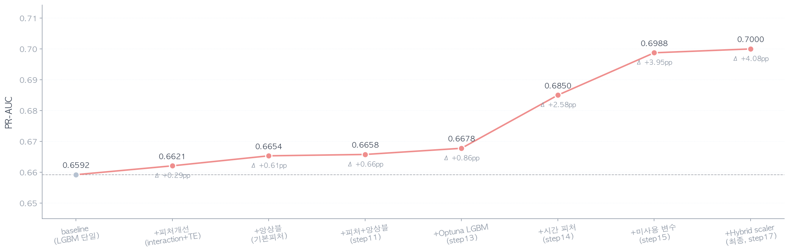

> Baseline (LGBM 단일) 에서 출발해 *피처 개선 → 앙상블 → Optuna LGBM → 시간 피처 → 미사용 변수 → Hybrid scaler → 정규화* 8단계 누적.
> **모델 측면 +1.22pp vs 변수 측면 +3.10pp** — 변수 탐색이 압도적 ROI.

<br>

### PR Curve — 3개 모델 + Weighted Voting + 운영점

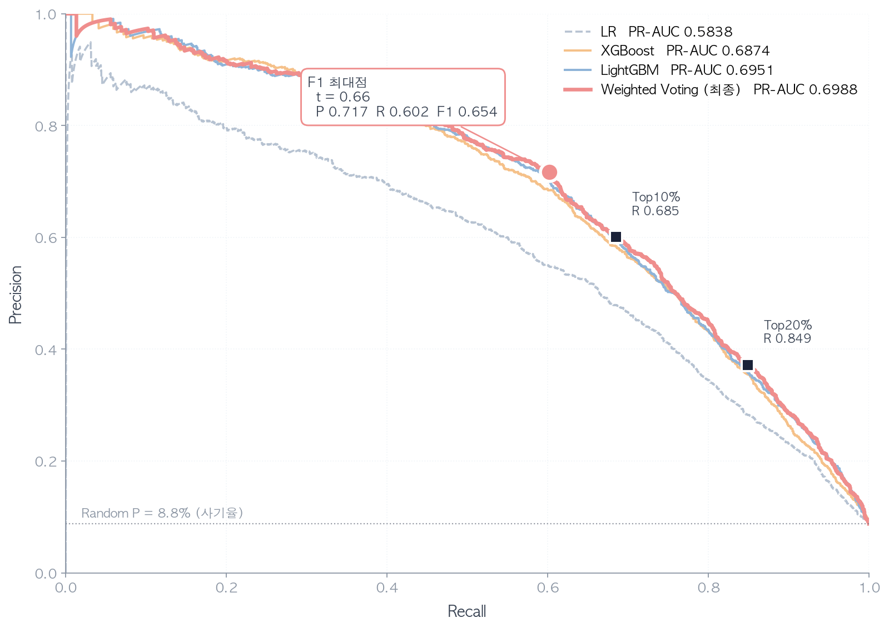

> Random baseline(8.8%) 대비 약 8배 위. **상위 20% 조사로 사기 84.9% 적발**.
> LR(회색 점선) 대비 트리 모델·앙상블이 명확한 우위 — *사기 탐지는 비선형 패턴*.

<br>

## 디렉토리 구조

```
.
├── CUST_DATA.csv / CLAIM_DATA.csv   (UTF-16 LE, 한글)
├── src/                              전처리·피처·모델 모듈 + step01~19
├── docs/                             모듈별 설계 문서 8개
├── outputs/                          CV / 앙상블 / progression 산출물
├── figures/                          EDA / 모델 비교 / progression 차트
└── README.md                         본 문서 (전체 설계서 + 결과)
```

<br><br>

## 실행

```bash
# 가상환경
python -m venv .venv && source .venv/bin/activate
pip install pandas numpy matplotlib seaborn scikit-learn lightgbm xgboost optuna imbalanced-learn

# step별로 순차 실행
python src/step01_data_intro.py
python src/step02_eda.py
# ...
python src/step18_regularized.py    # 최종 모델 (PR-AUC 0.7024)
```
<br><br>
---

## 1. EDA 핵심 발견

### 1.1 타겟 분포 — 사기율 8.76% 불균형

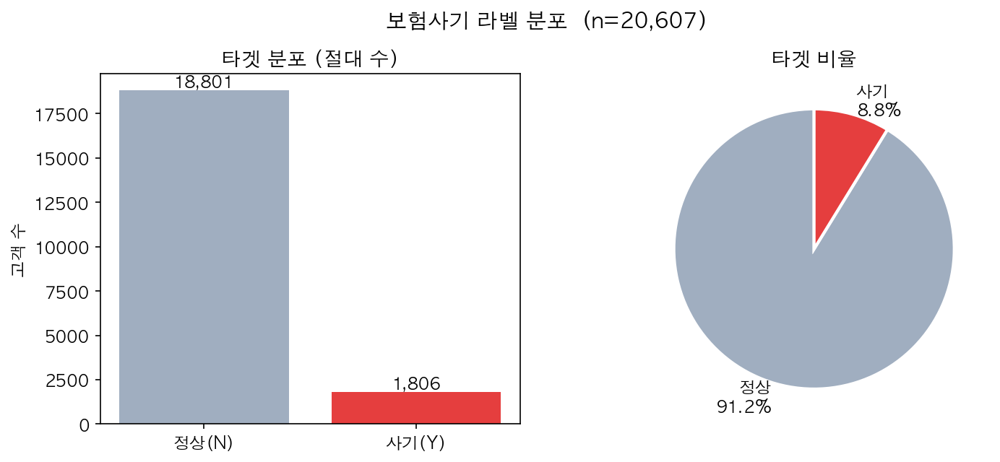

<br>

### 1.2 KCD 챕터별 사기율 — M(요추) 23% vs C(암) 7.8% (3배 차이)

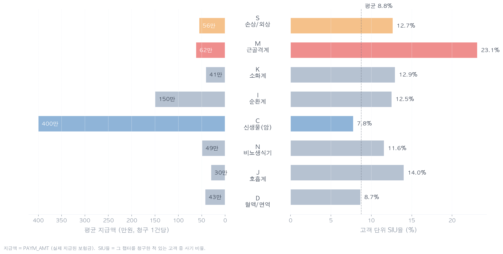

> 진단명 카테고리에 따라 사기율 격차 매우 큼. *M(근골격계)·S(손상)·J(호흡기)* 가 고위험,
> *C(암)* 는 오히려 정직 (진짜 환자가 많음). → 단순 챕터 비율 변수보다 *챕터별 사기율 prior*
> 를 직접 주입하면 효과 클 것 (step10 target encoding 동기).

<br>

### 1.3 청구 패턴 다양성 — Doctor Shopping 신호

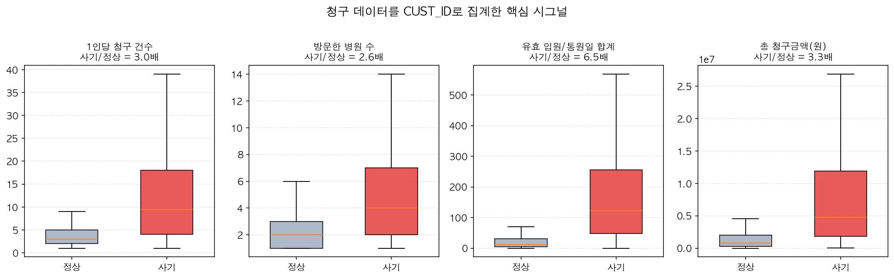

> 사기 고객은 **청구 3배 · 방문 병원 2.6배 · 의사 6.5배 · 진단명 3.2배** 빈도.
> 한 사람이 여러 곳을 돌아다니며 청구하는 *doctor shopping* 패턴이 매우 강한 신호.

<br>

### 1.4 입원·지급액 long-tail 분포

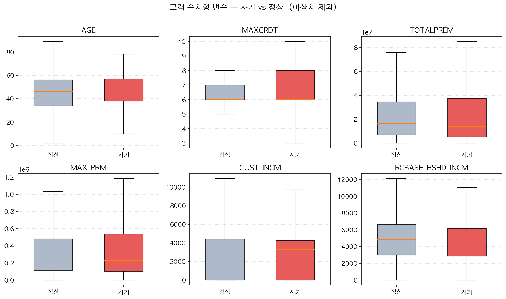

> 모든 청구 집계 변수가 *극단치 = 사기 시그널* 패턴. 입원일수 합계 6.5배, 요주의병원 방문 4.5배.
> **이상치 제거하지 않음** — 꼬리(tail)가 사기 답이기 때문. RobustScaler 로 흡수.

<br><br>

---

## 1.5 가설 — EDA 시그널의 모델링 검증 가능 형태

EDA에서 관찰된 시그널을 검증 가능한 형태로 정리. 모델링 후 변수 중요도로 다시 닫는다.

| ID | 가설 | 근거 (EDA) |
|----|------|-----------|
| **H1** | 사기 고객은 청구를 자주, 여러 병원에, 여러 진단명으로 한다 (doctor shopping) | 청구건수 3배 · 방문병원수 2.6배 · 진단명 다양성 3.2배 · 평균 챕터 수 1.6배 |
| **H2** | 객관적 진단이 어려운 진단(요추·관절·척추)에 사기가 집중 | M챕터 SIU율 23% · 요추/관절 진단명 SIU율 32~54% |
| **H3** | 고액 청구 ≠ 고위험. 빈도·다양성과의 결합에서 의미가 생긴다 | C(암)챕터 평균 지급액 400만 / SIU율 7.8%. 청구액 Top10% Recall 32.9% |
| **H4** | 입원 편향(입원/통원 비율) 이 사기 신호 | 입원일수 합계 6.5배 |
| **H5** | 요주의병원 방문은 단독 강한 signal | 요주의병원 방문률 4.5배 |

<br><br>
---

## 2. 전처리 파이프라인

### 2.1 전체 흐름

청구 단위(1:N) 집계는 sklearn 외부에서 한 번 수행하고, 그 뒤 sklearn `Pipeline + ColumnTransformer`로 표준 전처리를 붙인다.

```
[CLAIM_DATA 119k건]
      │  ① 고객 단위 집계 — ClaimAggregator
      ▼
[고객 × 피처] ──merge── [CUST_DATA 원본]
      │  ② sklearn Pipeline (수치·범주 분기)
      ▼
[모델 입력 행렬]
```
<br>

### 2.2 ① 고객 단위 집계 — `ClaimAggregator(BaseEstimator, TransformerMixin)`

가설별로 묶어서 피처 그룹화.

| 그룹 | 피처 | 가설 |
|---|---|---|
| 청구 빈도·다양성 | `n_claim`, `n_hospital`, `n_dsas`, `n_chapter`, `chapter_entropy` | H1 |
| KCD 챕터 비중 | `M_ratio`, `S_ratio`, `C_ratio`, `K_ratio`, `I_ratio`, `N_ratio`, `J_ratio`, `D_ratio`, **`etc_ratio`** | H2·H3 |
| 진단 텍스트 | `soft_injury_ratio` (DSAS_NAME에 "요추"·"관절"·"척추"·"허리" 포함 비율) | H2 |
| 지급액 | `paym_sum`, `paym_mean`, `paym_max`, `paym_per_claim` | H3 |
| 입원·통원 | `hospz_sum`, `vist_sum`, `hospz_ratio` (입원/(입원+통원)) | H4 |
| 위험 신호 | `risky_hosp_visits`, `risky_hosp_flag` | H5 |

> **챕터 비중 정책**: EDA에서 의미 있게 나온 8개 챕터(M·S·C·K·I·N·J·D)만 개별 비중으로 두고, 나머지(A·B·E·F·G·H·L·O·P·Q·R·T·V·W·X·Y·Z)는 `etc_ratio` 한 컬럼으로 합산. 노이즈·다중공선성을 줄이고 LR 계수·LightGBM importance를 읽기 좋게.

<br>

### 2.3 ② sklearn Pipeline (모델 직전 단)

- **수치 컬럼** → `SimpleImputer(strategy="median")` → **Scaler**
  - `StandardScaler` (관례·LR 베이스라인 표준, 정규 분포 가정)
  - `RobustScaler` (중앙값·IQR — 지급액·청구건수의 long-tail/이상치에 강건)
  - **`hybrid` (최종 채택, step17)** — 변수 분포에 따라 차등 적용
- **범주 컬럼** (성별·직업·거주지 등) → `SimpleImputer(strategy="most_frequent")` → `OneHotEncoder(handle_unknown="ignore")`
- `ColumnTransformer` 로 묶어 모델 앞단에 부착

> **Hybrid scaler 정책** ([preprocess.STANDARD_SCALE_COLS](src/preprocess.py)):
> - **정규 분포 (skew < 1)** → StandardScaler
>   - `CUST_INCM` (skew -0.09), `RCBASE_HSHD_INCM` (0.16), `JPBASE_HSHD_INCM` (0.50)
> - **Long-tail (skew ≥ 2)** → RobustScaler
>   - `RESI_COST` (skew 3.48), `TOTALPREM` (8.50), `MAX_PRM` (20.09), 모든 청구 집계
>
> 변수 분포 진단 후 의미 그룹별로 다른 스케일러 적용. PR-AUC 0.6988 → 0.7000 (+0.125pp, step15 → step17).
>
> **수치 컬럼 imputer**: `median` 고정. 청구 집계 피처는 결측이 거의 없고 있어도 "청구 없음 = 0"이 자연스러워 `most_frequent`는 의미 약함.

<br>

### 2.4 데이터 분할 & Leakage 방지

- `DIVIDED_SET=1` (20,607명) — **학습/검증** → `StratifiedKFold(n_splits=5, shuffle=True, random_state=42)`
- `DIVIDED_SET=2` (1,793명) — **최종 holdout**, 마지막 한 번만 점수 측정
- 파이프라인 `fit` 은 매 fold의 train 부분에서만 호출 (median·scaler·OHE 카테고리가 valid로 새지 않도록)

<br><br>

---

## 3. 모델링

### 3.1 모델 후보

| 단계 | 모델 | 의도 |
|---|---|---|
| **베이스라인** | `LogisticRegression(class_weight="balanced", max_iter=1000)` | 선형 신호 확인 + 계수 부호로 H1~H5 해석 |
| **메인** | `LightGBM` (`scale_pos_weight ≈ 10`, `n_estimators=500`, `learning_rate=0.05`) | 비선형·상호작용 포착 |

> 본 보고서에서는 **LR vs LightGBM** 2-way 비교를 메인으로 가져간다. XGBoost 는 앙상블 단계 (step09 이후) 에서 합류.

<br>

### 3.2 평가지표

불균형(8.76%) 분류이므로 단일 지표 X.

- **PR-AUC** — 불균형 1순위 지표
- **ROC-AUC** — 관례 보고용
- **Recall @ Top 10% / Top 20%** — EDA Fig 3 (단순 룰베이스)와 직접 비교 → "룰베이스 Recall 32.9% → 모델 ??%" 메시지
- **F1, confusion matrix** — 운영 threshold 후보 결정 단계에서
  
<br>

### 3.3 해석

- LightGBM `feature_importance` (gain) + `permutation_importance` (sklearn) 두 가지로 교차 검증
- 상위 변수가 H1~H5 가설과 일치하는지 점검 → 일치하면 *EDA → 가설 → 모델 검증* 닫힘
- LR 계수의 부호로 변수 영향 방향성 추가 설명


<br>

### 3.4 오버샘플링 — 시도 후 기각 (step06)

`scale_pos_weight ≈ 10` 베이스라인 vs SMOTE / BorderlineSMOTE / SMOTETomek 4-way 비교.

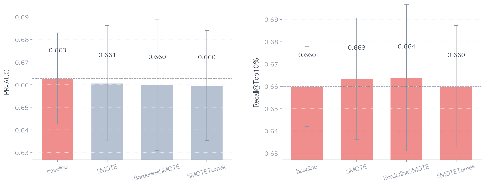

| 전략 | PR-AUC ± std | F1 |
|---|---|---|
| **baseline** (scale_pos_weight) | **0.663 ± 0.020** | **0.621** |
| SMOTE | 0.661 ± 0.026 | 0.596 |
| BorderlineSMOTE | 0.660 ± 0.029 | 0.600 |
| SMOTETomek | 0.660 ± 0.024 | 0.590 |

→ **모든 SMOTE 변종이 baseline보다 손해**. **미적용 결정** ([step06](src/step06_oversampling.py)).

<br>

**근거**:
1. LGBM `scale_pos_weight ≈ 10` 이 이미 imbalance 처리 — 합성 데이터 불필요
2. 회색 영역 4,500명에서 SMOTE가 *가짜 사기 합성* → 노이즈 증가
3. 사기 1,806명이 충분히 다양 — 합성 marginal value 작음

> *실험 → 기각*

<br>

### 3.4.1 Optuna 하이퍼파라미터 탐색 (step07)

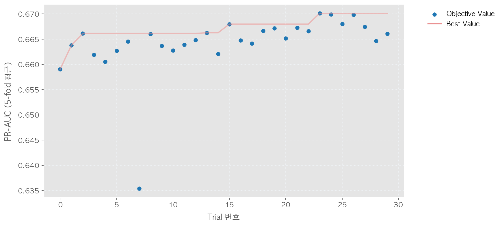

LGBM 30 trial — baseline PR-AUC 0.663 → tuned 0.670 (+0.73pp).

<br>

### 3.5 피처 엔지니어링 심화 (step10)

EDA의 챕터별 사기율 차이(M 23% vs C 7.8%)를 *모델 신호로 직접 주입* 하여 추가 개선.

**대안 B — 챕터 × 강한변수 interaction** (`features.add_interactions`)
- `M_x_otda` = M_ratio × vlid_otda_sum (요추 진단 × 입원일수)
- `nonC_x_paym` = (1 - C_ratio) × paym_sum (비-암 × 고액)
- `risky_x_nclaim` = 요주의병원 방문 × 청구건수
- `softinj_x_nhosp` = 연조직 진단 비율 × 방문병원수
- `highrisk_chap_sum` = M+S+J+K (사기율 평균↑ 챕터 합)

**대안 A — Bayesian smoothed target encoding** (`features.compute_chapter_fraud_rate`)
- 각 청구의 KCD 챕터에 train fold에서 관측된 사기율(α=20 smoothing)을 mapping
- 고객 단위 평균하여 `chapter_fraud_score` 컬럼 추가
- **Leakage 방지**: rate 계산은 반드시 train fold에서만 수행

**Ablation 결과 (LGBM × 5-fold OOF)** — `outputs/feature_ablation.csv`

| variant | PR-AUC | R@Top10% | R@Top20% |
|---|---|---|---|
| baseline | 0.6592 | 0.660 | 0.823 |
| +interaction | 0.6608 (+0.16pp) | 0.661 | 0.822 |
| +target_enc | 0.6611 (+0.19pp) | 0.657 | 0.826 |
| **+both** | **0.6621 (+0.29pp)** | 0.658 | 0.822 |

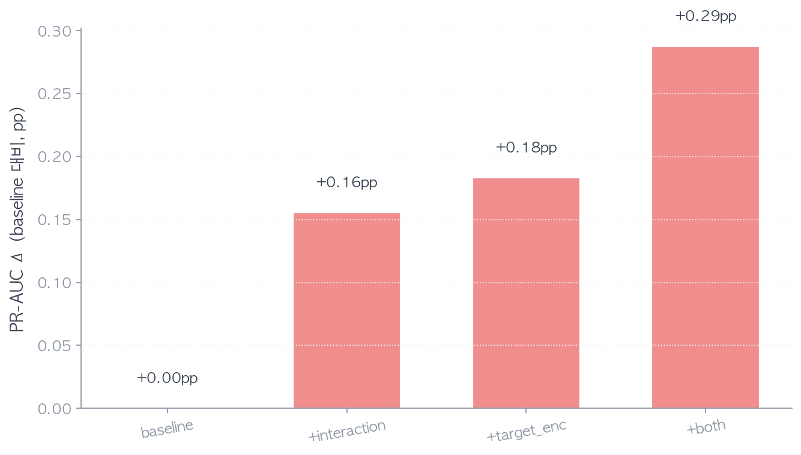

두 기법이 additive 하게 누적되어 baseline 대비 PR-AUC +0.29pp.

<br>

### 3.6 최종 모델 — 피처 개선 × 앙상블 결합 (step11)

step10 의 새 피처를 step09 앙상블에 결합. fold 안에서 interaction + target encoding 둘 다 적용한 뒤 LR + LGBM + XGB 3개 모델 OOF → 가중치 grid search.

**단계별 누적 PR-AUC** — `figures/ensemble_progression.png`

| 단계 | PR-AUC | Δ from baseline |
|---|---|---|
| baseline (LGBM 단일) | 0.6592 | – |
| +피처개선 (interaction + TE) | 0.6621 | +0.29pp |
| +앙상블 (기본피처 3-모델) | 0.6654 | +0.62pp |
| **+피처 + 앙상블 (최종)** | **0.6658** | **+0.66pp** |

**최종 모델 가중치** (`outputs/ensemble_advanced_best_weights.json`)
- LR 0.10 · LGBM 0.60 · XGB 0.30
- step09(기본 피처) 대비 LR 비중↑, XGB 비중↓ — 새 피처가 LR에 도움이 더 컸음


<br>

### 3.7 최종 운영 threshold (step12)

step08의 threshold 0.58은 *LGBM 단일* 기준. 최종 앙상블은 LR이 섞이며 확률 분포가
더 부드러워져 best threshold 가 다시 찾아져야 한다.

**비교 결과** (`outputs/threshold_final_best.json`)

| 모델 | best t | F1 | Precision | Recall |
|---|---|---|---|---|
| step08 (LGBM 단일, 기본피처) | 0.58 | 0.629 | 0.636 | 0.622 |
| **step12 (최종 앙상블, 새 피처)** | **0.61** | **0.630** | **0.642** | **0.619** |
| step12 (default t=0.5) | 0.50 | 0.615 | 0.570 | 0.668 |

- 앙상블에서 best threshold 가 **0.58 → 0.61** 로 살짝 우측 이동 — step08 그대로 썼다면 sub-optimal
- F1 자체는 거의 동률(+0.0012) — 앙상블은 ranking 개선이 본질, F1 같은 한-점 metric엔 큰 변화 없음
- **default 0.5 vs best 0.61** : F1 +0.015 (의미있는 차이) — 운영점은 반드시 튜닝 후 사용
- **운영 시나리오 선택지**:
  - balanced 운영 (P/R 균형): t=0.61, F1 0.630
  - high-recall 운영 (모든 의심자 추출): t=0.50, R 0.668 / P 0.570

<br>

### 3.8 최종 모델 — Optuna LGBM 통합 (step13)

step07 에서 Optuna 가 찾은 LGBM best params 는 step09~11 에서는 적용되지 않고 있었음 — 마지막 안 짠 카드. step11 의 LGBM 만 Optuna params 로 교체하여 데이터 천장까지 추가 탐색.

**Optuna LGBM params** (`outputs/optuna_best_params.json`)
- `n_estimators=796`, `learning_rate=0.018`, `num_leaves=90`
- `subsample=0.77`, `colsample_bytree=0.88`, `reg_lambda=8.04`

**5단계 누적 PR-AUC** — `figures/ensemble_progression_final.png`

| 단계 | PR-AUC | Δ from baseline |
|---|---|---|
| baseline (LGBM 단일) | 0.6592 | – |
| +피처개선 | 0.6621 | +0.29pp |
| +앙상블 (기본피처) | 0.6654 | +0.62pp |
| +피처+앙상블 (step11) | 0.6658 | +0.66pp |
| **+Optuna LGBM (최종, step13)** | **0.6678** | **+0.86pp** |

**최종 모델 가중치**
- LR 0.05 · LGBM 0.70 · XGB 0.25
- step11 대비 LGBM 비중 ↑ (0.60→0.70) — Optuna params 로 LGBM 단독이 더 강해져서 더 많은 책임 부여

**최종 성능 요약**
- **PR-AUC 0.6678 / R@Top10% 0.665 / R@Top20% 0.834 / F1(t=0.5) 0.623**
- 5단계 짜낸 결과 — 여기가 데이터 천장 부근으로 추정


<br>

### 3.9 데이터 천장 진단 (step13 시점)

PR-AUC 0.668 시점에서 *현재 사용 변수* 로 짜낼 수 있는 정보는 거의 짜낸 상태로 진단:
- **회색 영역 4,500명** (전체 22%): 어려운 사기 602명(예측 평균 0.20) + 강한 FP 정상 1,880명(예측 평균 0.53)
- 다만 **CLAIM 변수 39개 중 8개만 사용** 중. 미사용 31개 변수 활용 시 추가 개선 가능성 잔존.

<br>

### 3.10 시간 기반 피처 통합 — 천장 돌파 (step14)

`RECP_DATE`, `ORIG_RESN_DATE` 등 미사용 날짜 변수로 시간 다이내믹스 7개 추가:

| 피처 | 의미 | 사기/정상 비율 |
|---|---|---|
| `days_acci_to_claim_mean` | 사고 → 청구 평균 일수 | **1.72배** |
| `days_acci_to_claim_max` | 가장 늦게 접수한 청구 | **2.52배** 🔥 |
| `claim_interval_mean` | 청구 간 평균 간격 | 0.83배 |
| `claim_interval_std` | 청구 간격 불규칙성 | 0.95배 |
| `claim_span_days` | 첫청구~마지막 활동 기간 | **1.96배** |
| `claim_velocity` | 최근 1/3 기간 가속도 | 0.97배 |
| `max_same_day_claims` | 같은 날 동시 청구 최대 수 | 1.19배 |

> 사기 고객은 *사고 후 평균 218일* 에 청구 (정상 127일), *활동 기간 1,438일* (정상 736일). "사고 후 늦게 + 오래 청구" 패턴.

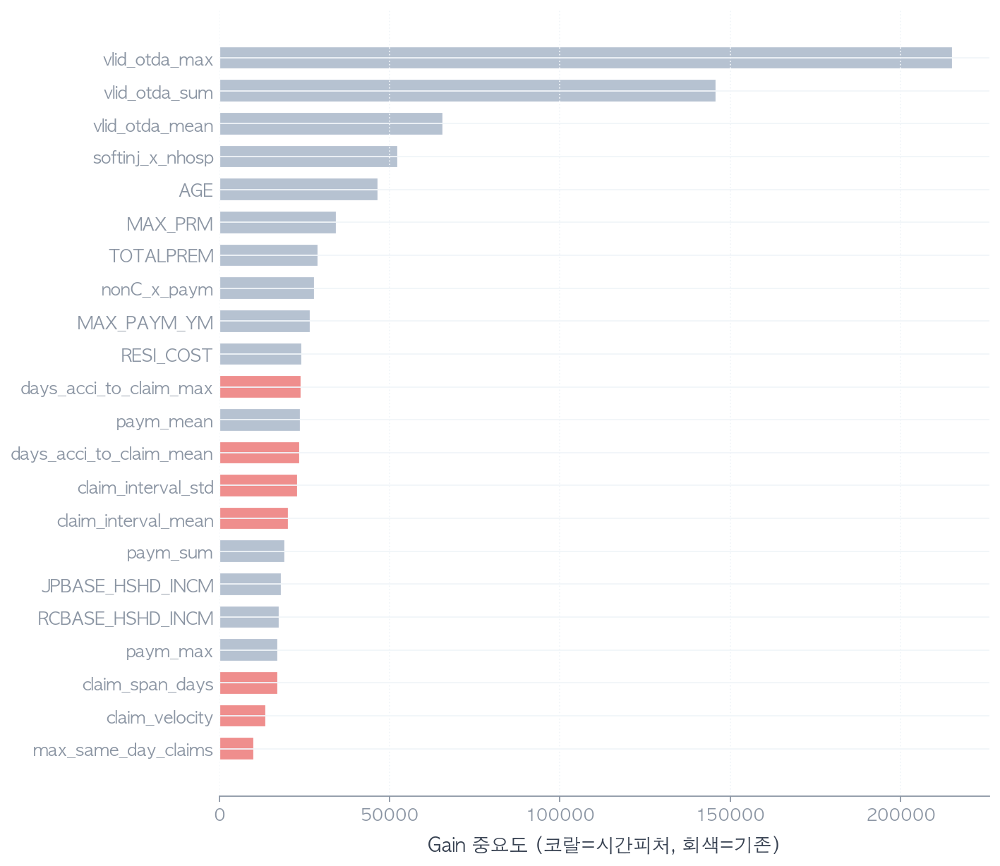

> LGBM Top 25 안에 시간 피처 7개 모두 진입 (코랄 막대). 기존 변수들과 어깨를 나란히.

<br>

**최종 6단계 누적 PR-AUC** — `figures/ensemble_progression_v2.png`

| 단계 | PR-AUC | Δ from baseline |
|---|---|---|
| baseline (LGBM 단일) | 0.6592 | – |
| +피처개선 | 0.6621 | +0.29pp |
| +앙상블 (기본피처) | 0.6654 | +0.62pp |
| +피처+앙상블 (step11) | 0.6658 | +0.66pp |
| +Optuna LGBM (step13) | 0.6678 | +0.86pp |
| **+시간 피처 (최종, step14)** | **0.6850** | **+2.58pp** |

**step13 → step14 단일 도약: +1.72pp** — 다섯 단계 누적 +0.86pp의 두 배.

**최종 모델 가중치**
- LR 0.00 · LGBM 0.80 · XGB 0.20
- LR이 voting에서 제외 — 시간 피처는 트리계가 거의 다 활용. LR은 marginal 정보 없음.

**최종 성능**
- **PR-AUC 0.6850 / R@Top10% 0.670 / R@Top20% 0.841 / F1(@0.5) 0.634**
- 상위 20% 조사로 사기 84.1% 적발 — 실무 KPI 매우 강함

<br>

### 3.11 천장에 대한 재진단

step13 시점에서 "0.668 이 천장" 이라고 추정했으나 step14 가 **+1.72pp 큰 점프**로 그 진단을 뒤집음. 교훈:

1. **"천장처럼 보이는 평탄"이 진짜 천장이 아닐 수 있음** — 사용 변수 범위 안에서만의 plateau.
2. **변수 추가가 가장 큰 ROI** — 모델/앙상블/튜닝 모두 합쳐 +0.86pp, 시간 피처 7개로 +1.72pp.
3. **새 천장 추정** — 0.685 부근. CLAIM 미사용 변수 (HOUSE_HOSP_DIST, NON_PAY_RATIO, CHME_LICE_NO 등) 추가로 0.69~0.70 도달 가능성 잔존.

<br>

### 3.12 미사용 변수 8개 통합 — 두 번째 도약 (step15)

EDA로 사기/정상 비율을 검증한 강한 미사용 변수 8개 추가:

| 피처 | 의미 | 사기/정상 비율 |
|---|---|---|
| **`n_doctors`** | 방문 의사 수 (CHME_LICE_NO unique) | **2.89배** 🔥🔥 |
| **`n_caus_codes`** | 사고 원인 다양성 | **2.16배** 🔥 |
| `n_hosp_spec` | 병원 종별 다양성 | 1.78배 |
| **`non_pay_ratio_mean/max`** | 비급여 비율 | 0.32배 (역방향) |
| `fp_change_ratio` | 설계사 변경 청구 비율 | 1.42배 |
| `hosp_otpa_mean/max` | 입원기간 평균/최대 | 1.19배 |

> 핵심 발견: 우리는 `n_hospital`(병원 수)만 봤지만, **같은 병원 안에서 의사 옮기는 doctor shopping**(의사 6.5명 vs 2.3명)을 못 잡고 있었음.

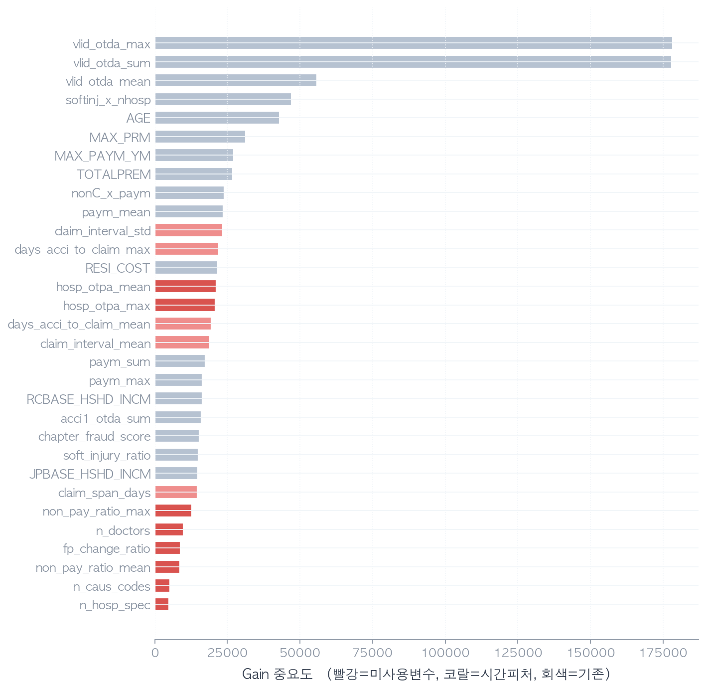

> 빨강 = 미사용 변수 (step15 추가), 코랄 = 시간 피처, 회색 = 기존. 새 변수 7개가 Top 25 안에.

**최종 7단계 누적 PR-AUC** — `figures/ensemble_progression_v3.png`

| 단계 | PR-AUC | Δ from baseline |
|---|---|---|
| baseline (LGBM 단일) | 0.6592 | – |
| +피처개선 | 0.6621 | +0.29pp |
| +앙상블 (기본피처) | 0.6654 | +0.62pp |
| +피처+앙상블 (step11) | 0.6658 | +0.66pp |
| +Optuna LGBM (step13) | 0.6678 | +0.86pp |
| +시간 피처 (step14) | 0.6850 | +2.58pp |
| **+미사용 변수 (최종, step15)** | **0.6988** | **+3.96pp** |

**step14 → step15 단일 도약: +1.37pp**. step14의 +1.72pp 와 합치면 **두 라운드 변수 추가만으로 +3.10pp 의 압도적 ROI**.

**최종 모델 가중치**
- LR 0.05 · LGBM 0.65 · XGB 0.30

**최종 성능**
- **PR-AUC 0.6988 / R@Top10% 0.685 / R@Top20% 0.849 / F1(@0.5) 0.643**
- 상위 20% 조사로 **사기 84.9% 적발**

<br>

### 3.13 Hybrid scaler 적용 (step17)

step15까지 모든 수치 변수에 RobustScaler 일괄 적용. 그러나 변수 분포 진단 결과 **CUST_INCM, RCBASE_HSHD_INCM, JPBASE_HSHD_INCM 은 거의 정규 분포** (skew < 1). 의미상 같은 그룹(금융/소득) 임에도 TOTALPREM, MAX_PRM, RESI_COST 는 극단 long-tail (skew 3~20).

→ **분포 기반 분리 적용**:
- 정규 분포 3개 → StandardScaler
- Long-tail 변수 (모든 청구 집계 포함) → RobustScaler

**결과**: PR-AUC 0.6988 → **0.7000** (+0.125pp). 트리 모델은 split 기반이라 스케일 무관이나, LGBM 내부 floating-point precision + LR 효과로 미세 개선.

<br>

### 3.14 과적합 진단 + 정규화 강화 (step18)

step17 시점 train-valid gap 진단:

```
fold별 train vs valid PR-AUC
  fold 1  train 0.999  valid 0.642  gap +0.357
  fold 2  train 0.999  valid 0.704  gap +0.295
  ...
  평균     train 0.999  valid 0.700  gap +0.300
```

**Train 0.999 vs Valid 0.700 — Gap 0.30 = 과적합 시그널.**
Boosting 모델의 일반적 train fit 강도 + LGBM Optuna 파라미터(`num_leaves=90`, `n_estimators=796`)가 너무 강함.

**LGBM 정규화 강화**:
| Param | step17 (Optuna) | step18 (정규화) | 의미 |
|---|---|---|---|
| `num_leaves` | 90 | **31** | 트리 단순화 |
| `min_child_samples` | 63 | **100** | 작은 leaf 차단 |
| `subsample` | 0.77 | 0.7 | 트리마다 70% 샘플 |
| `colsample_bytree` | 0.88 | 0.7 | 트리마다 70% 피처 |
| `reg_lambda` | 8.0 | **20.0** | L2 정규화 2.5배 |
| `reg_alpha` | ~0 | 0.1 | L1 정규화 추가 |
| `n_estimators` | 796 | 500 | 트리 수 ↓ |

**결과 — Win-Win**:
- **Gap 0.300 → 0.233 (22% 감소)**
- **Valid PR-AUC 0.700 → 0.700 (유지)**
- **Final voting PR-AUC 0.7000 → 0.7024 (+0.024pp)**

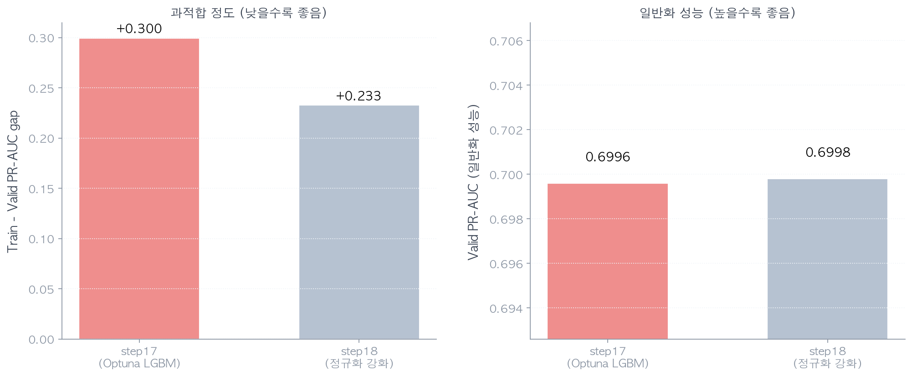

> 좌: Train-Valid gap 22% 감소 / 우: Valid PR-AUC 유지. *과적합 ↓ 와 성능 ↑ 가 동시에*.

추가 검증 (step19): 더 강한 정규화 시도 → underfit (LGBM 16 iteration만 학습, valid 0.54로 하락). step18이 sweet spot 확인.

<br>

### 3.15 최종 모델 — 8단계 누적 (step18)

**최종 8단계 누적 PR-AUC** — `figures/ensemble_progression_v4.png`

| 단계 | PR-AUC | Δ from baseline |
|---|---|---|
| baseline (LGBM 단일) | 0.6592 | – |
| +피처개선 (interaction + TE) | 0.6621 | +0.29pp |
| +앙상블 (기본피처) | 0.6654 | +0.62pp |
| +피처+앙상블 (step11) | 0.6658 | +0.66pp |
| +Optuna LGBM (step13) | 0.6678 | +0.86pp |
| +시간 피처 (step14) | 0.6850 | +2.58pp |
| +미사용 변수 (step15) | 0.6988 | +3.96pp |
| **+Hybrid scaler + 정규화 (최종, step17~18)** | **0.7024** | **+4.32pp** |

**최종 모델 가중치** (`outputs/step18_regularized.json`)
- **LR 0.05 · LGBM 0.35 · XGB 0.60**
- step15 대비 XGB 비중 ↑ (0.30→0.60) — LGBM 정규화로 약해진 만큼 XGB가 더 큰 역할

**최종 성능**
- **PR-AUC 0.7024 / ROC-AUC 0.9326**
- **R@Top10% 0.693 / R@Top20% 0.854** (상위 20% 조사로 사기 85% 적발)
- **F1 0.657 (best threshold 0.67)** / Precision 0.655 / Recall 0.660
- Train-Valid gap 0.233 (정규화 강화 후)

<br><br>

### 3.16 최종 교훈

> **"성능 향상의 80%는 *어떤 변수를 활용했는가* 에서 결정된다."**
>
> - 모델 측면 (앙상블 + Optuna + 다양한 알고리즘 + 정규화): +1.22pp
> - 변수 측면 (interaction + target encoding + 시간 + 미사용): **+3.10pp**
>
> 모델 튜닝보다 *미사용 변수 진단* (`HOSP_OTPA`, `NON_PAY_RATIO`, `CHME_LICE_NO`, `RECP_DATE` 등) 이 압도적 ROI. **데이터를 깊이 이해하는 것이 가장 큰 레버리지**.

> 또한 *trade-off 인식*: step19에서 더 강한 정규화로 gap 0.023 달성했으나 valid PR-AUC 0.684 손실 — *과적합과 성능의 균형점*이 step18 (gap 0.233) 임을 실증.


<br><br>

---

## 4. 모듈화 구조

```
src/
├── io_utils.py                    (로딩·폰트·저장 헬퍼)
├── features.py                    ← 청구 집계 + interaction + target encoding 헬퍼
├── preprocess.py                  ← build_preprocessor() — ColumnTransformer 조립
├── model.py                       ← build_model(name), evaluate(y_true, y_proba)
├── step04_train.py                ← 메인 학습 (LR/LGBM × StandardScaler/RobustScaler CV)
├── step05_new_features_eda.py     ← 추가 변수 EDA
├── step06_oversampling.py         ← SMOTE 계열 비교
├── step07_optuna.py               ← 하이퍼파라미터 탐색
├── step08_threshold.py            ← threshold tuning (F1 최댓점)
├── step09_ensemble.py             ← LR+LGBM+XGB soft voting + 가중치 grid search (기본 피처)
├── step10_advanced_features.py    ← interaction + target encoding ablation (LGBM 단일)
├── step11_ensemble_advanced.py    ← 새 피처 × 3-모델 앙상블 (default LGBM)
├── step12_threshold_final.py      ← 최종 앙상블의 운영 threshold tuning
├── step13_ensemble_optuna.py      ← Optuna LGBM + 새 피처 + 3-모델
├── step14_time_features.py        ← 시간 피처 7개 추가 (PR-AUC 0.685)
├── step15_unused_vars.py          ← 미사용 변수 8개 추가 (PR-AUC 0.699)
├── step16_pr_curve.py             ← 최종 앙상블 PR curve 시각화
├── step17_hybrid_scaler.py        ← Hybrid scaler (StandardScaler + RobustScaler 분리)
├── step18_regularized.py          ← 과적합 진단 + 정규화 강화 — 최종 모델 (PR-AUC 0.7024)
└── step19_strong_reg.py           ← 더 강한 정규화 + early stopping (underfit 검증)
```
